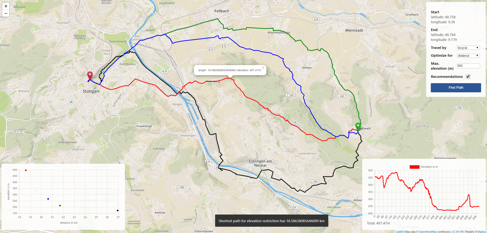

# OSM Bike Route Planner
by Simon Matejetz

This project is part of "Lab Course: Algorithms for OSM Data" in Winter 2019/2020 at the University of Stuttgart and is forked from the previous group project with Felix Buehler.
It adds elevation data from the NASAs <cite>SRTM3 elevation database[3]</cite> to the<cite>OpenStreetMap[4]</cite> graph and extends the previous project by adding the posibility to define a *maximum elevation* for the returned shortest route. For this, the <cite>LARAC Algorithm[1]</cite> was implemented using the <cite>Rust programing language[2]</cite>.

This repository consists of two programs:
## pre

This crate is for lazily downloading, accessing parsing and interpolating the <cite>SRTM3 elevation data[3]</cite>.
Its also for parsing the `*.osm.pbf` file into a `*.osm.pbf.fmi` file, which then contains all <cite>OpenStreetMap[4]</cite> nodes and with their respectiv elevations as well as the edges between them and acts as the data basis for the `web`-program

When preparsing the <cite>OpenStreetMap[4]</cite> files, the elevation for each note is read from the respective SRTM file, if not found locally the file is automatically downloaded and unzipped. The nodes elevation is interpolated using its the 1NN (nearest neighbor) and 2NN to get more accurate results since all elevation data is only available in integers.

### dependecies

- `osmpbfreader` = parsing the pbf file
- `serde` = serialization
- `bincode` = exporting serialization
- `reqwest` = downloading `.hgt.zip` srtm files
- `zip` = extracting downloaded `.hgt.zip` files to receive the `.hgt` file containing elevation data

### Compilation
`cargo build --release`

### Usage
`cargo run --release [PATH_TO_OSM_PBF_FILE]`

## web

Is the webserver which provides the interface and executes the <cite>LARAC (Lagrange Relaxation based Aggregated Cost)[1]</cite> algorithm for the chosen start and destination node. It needs the `.osm.pbf.fmi`-file from the `pre`-programm as an input to used as a data source.

As seen in the screenshot above, the user provided a max elevation of 500m as an input and agreed to also receive recommended paths in his elevation range other than the shortest one.  
On the bottom left is a scatter diagram that shows how the different recommended routes are balancing between elevation and distance. In this example, the red-lined path is the "optimal path" for the users request and usually the only route the bike route planner returns. Here two other recommendation (blue + green) along with the lowest elevation path with the (black) were returned by the modified LARAC algorithm.  
The LARAC algorithm approaches the optimal route by giving different weightings for distance and elevation to the underlying dijkstra's algorithm. For giving additional recommendations to the user, the LARAC algorithm was modified to not only return the shortest route under a given threshold (max elevation) but instead also returning all paths that were computed under a different weighting and have a maximum elevation in the range provided by the user.  
On hovering over a specific path, the user can get more detailed informations about a paths distance and elevation and additionally a height profile of the track is drawn in the bottom right corner of the screen.

### dependecies

- `actix-files` = serving static files
- `actix-web` = webserver
- `serde` = serialization
- `bincode` = exporting serialization
- `serde_json` = parsing json

### Compilation

`cargo build --release`

### Usage

`cargo run --release [PATH_TO_OSM_PBF_FMI_FILE]`

[1]: A. Juttner, B. Szviatovszki, I. Mecs, and Z. Rajko, “Lagrange Relaxation
Based Method for the QoS Routing Problem,” IEEE INFOCOM’2001,
April 2001.  
[2]: https://www.rust-lang.org/  
[3]: https://dds.cr.usgs.gov/srtm/version2_1/SRTM3/Eurasia/  
[4]: https://www.openstreetmap.org/